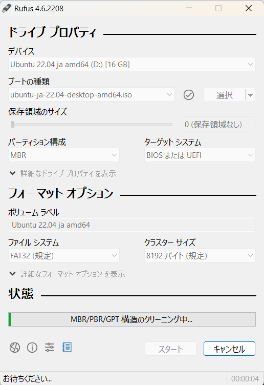

## Linuxサーバの構築

### 〇目次
[1. UbuntuOSのインストール](#1-ubuntuosのインストール)  
[2. 初期設定](#2-初期設定)  
[3. 事前知識](#3-事前知識)  
[4. サーバー管理](#4-サーバー管理)  
[5. Webサーバの構築](#5-webサーバの構築)  
[6. SSHによる認証](#6-sshによる認証)  
[7. Dockerによる環境構築や運用](#7-dockerによる環境構築や運用)  
[8. 参考文献](#8-参考文献)

### 1. UbuntuOSのインストール

#### 1.1 UbuntuのインストールUSBメディアを作成する
1. 下記リンクから、インストールイメージ:`ubuntu-ja-22.04-desktop-amd64.iso` をダウンロードする。
   - [Ubuntu日本語Remixダウンロードページ](https://www.ubuntulinux.jp/download/ja-remix)

2. Rufusをダウンロードして開く。
3. デバイスはUSBメモリを選択する。
   - ブートの種類は右側の`選択`から`ubuntu-ja-22.04-desktop-amd64.iso`を選択する。
4. `スタート`をクリックし、ダウンロードが完了するとインストールメディアの作成は完了。
   - 

#### 1.2 OSのインストール手順
1. `1.1`で作成したインストールUSBメディアを貸与PCに差し込む。
2. 電源をつけながら`F2`キーを連打しバイオスを開く。
3. 右端の`Boot Priority`で`UEFI`を一番上に配置して、`F10`キーで保存する。
4. その後`Try or Install Ubuntu`をEnterで選択し、しばらくすると自動でインストール画面が開く。
5. `Ubuntuをインストール`を選択する。
6. キーボードレイアウトは変更がないため、そのまま`続ける`を押す。
7. 無線も同様に`続ける`を押す。
8. アップデートとほかのソフトウェアも同様に`続ける`を押す。
9. インストールの種類では上から２つ目の`ディスクを削除してUbuntuをインストール`を選択して、続けるを押す。
10. `インストール`→`続ける`を押す。
11. 地名を`Osaka`に変更し、`続ける`を押す。
12. 各名称・パスワードを設定し`続ける`を押すとインストールが開始される。
13. インストールが完了すると、`今すぐ再起動する`を押す。
14. セットアップ画面では`次へ`→`次へ`→`次へ`→`続ける`を押して、完了する。

### 2. 初期設定
#### 2.1 Wi-Fiの初期接続方法
1. 右上からネットワークを選択をクリックする。
2. 任意のネットワークを指定し接続をクリックする。
3. すると、`Wi-Fiネットワークの認証が必要です。`というウィンドウが表示される。
4. 認証のプルダウンから`LEAP`を選択する。
5. そして、ユーザー名とパスワードを入力して接続する。

#### 2.2. 全角日本語の入力方法
日本語入力ができない場合は、`fcitx-mozc`をインストールする必要がある。
以下のコマンドを実行する。

```sh
sudo apt install -y fcitx-mozc
```

そして、右上の`A`をクリックし、`日本語(Mozc)`を選択する。

### 3. 事前知識
#### 3.1 基礎コマンド
この実習でよく使用した順にコマンドを紹介する。
- `cd`: ディレクトリを変更する
- `ls`: ディレクトリの内容を一覧表示する
- `vi`: テキストエディタを開く
- `find`: ファイルやディレクトリを検索する
- `mkdir`: 新しいディレクトリを作成する
- `touch`: 空のファイルを作成する
- `ping`: ネットワーク接続を確認する
- `mv`: ファイルやディレクトリを移動または名前を変更する
- `rm`: ファイルやディレクトリを削除する
- `ps`: 実行中のプロセスを表示する
- `kill`: プロセスを終了する

#### 3.2 Vimコマンド
この実習でよく使用した順にコマンドを紹介する。
- `i`: 挿入モード
- `:wq`: 保存して終了
- `x`: 1字削除
- `dd`: 1行削除
- `u`: 直前の操作を元に戻す
- `yy`: 1行コピー
- `p`: 貼り付け

#### 3.3 ファイルのアクセス権の変更手順
Linuxでは、ファイルやディレクトリには所有者とグループが設定され、それぞれに対してアクセス権限（パーミッション）が割り当てられる。パーミッションには、以下の3種類がある。

- **r (読み取り権限)**: ファイルの内容を表示、ディレクトリ内のファイル一覧を表示する権限。
- **w (書き込み権限)**: ファイルの内容を変更、ディレクトリ内にファイルを作成・削除する権限。
- **x (実行権限)**: ファイルを実行できる権限、ディレクトリ内を移動できる権限。

**〇変更手順**

1. **パーミッションの確認**
    ```sh
    ls -l ファイル名
    ```
    出力例：
    ```sh
    -rw-r--r-- 1 user group 1234 Jan 1 12:00 example.txt
    ```
    ここで、`-rw-r--r--` は所有者(user)が`rw`、グループ(group)が`r`、その他が`r` の権限を持っていることを示す。

2. **chmod コマンドで権限を変更**
    ```sh
    chmod 755 ファイル名
    ```
    - `7 (rwx)`: 所有者に読み取り、書き込み、実行を許可。
    - `5 (r-x)`: グループに読み取り、実行を許可。
    - `5 (r-x)`: その他に読み取り、実行を許可。

3. **chown コマンドで所有者を変更**
    ```sh
    sudo chown 新しい所有者:新しいグループ ファイル名
    ```
    例:
    ```sh
    sudo chown user2:group2 example.txt
    ```
    これにより、`example.txt` の所有者を `user2`、グループを `group2` に変更。

4. **chgrp コマンドでグループのみ変更**
    ```sh
    sudo chgrp 新しいグループ ファイル名
    ```
    例:
    ```sh
    sudo chgrp group2 example.txt
    ```
    これにより、グループを `group2` に変更。

#### 3.4 IPアドレスの固定化
1. **設定ファイルの確認**  
   `/etc/netplan` ディレクトリ内に新しい`.yaml`ファイルを作成し、以下の内容を追加する。ファイル名は`01-netcfg.yaml`などが一般的である。

    ```yaml
    network:
      version: 2
      renderer: networkd
      ethernets:
        enp0s3:
          dhcp4: no
          addresses:
            - 192.168.1.100/24
          gateway4: 192.168.1.1
          nameservers:
            addresses: [8.8.8.8, 8.8.4.4]
    ```

2. **設定の反映**  
   以下のコマンドを実行して、設定を適用する。

    ```sh
    sudo netplan apply
    ```

3. **動作の確認**  
   `ip a` コマンドや `ping` コマンドを使用して、設定が正しく適用されているか確認する。

### 4. サーバー管理
##### 4.1 ユーザ管理
1. ユーザを新規追加する際は以下のコマンドを入力し、パスワードやユーザ情報を入力する。
```sh
sudo adduser ユーザ名
```
2. ユーザをグループへ追加する際は以下のコマンドを入力する。
```sh
sudo usermod -aG グループ名 ユーザ名
```
3. ユーザをグループから削除する際は以下のコマンドを入力する。
```sh
sudo gpasswd -d ユーザ名 グループ名
```
4. ユーザを削除する際は以下のコマンドを入力する。
```sh
sudo userdel ユーザ名
```
5. ユーザを切り替える際は以下のコマンドを入力する。
```sh
su ユーザ名
```
6. rootユーザに切り替える際は以下のコマンドを入力する。
```sh
su または su -
```

### 4.2 サービス管理
1. サービスの起動や停止などを管理するには`systemctl`コマンドを使用する。
```sh
systemctl サブコマンド サービス名
```
具体的なサブコマンドは以下の通り。

- `start`: サービスを開始する
- `stop`: サービスを停止する
- `reload`: サービスを再起動する（サービスの停止なしで設定を反映させる）
- `restart`: サービスを再起動する（サービスを停止し設定を反映させる）
- `enable`: システム起動時にサービスを自動的に開始する
- `disable`: システム起動時にサービスが自動的に開始しないようにする
- `status`: サービスの状態を確認する


#### 4.3 負荷状況の確認
1. サーバの負荷を確認するためには`uptime`コマンドを使用する。
1. ディスクの使用状況を確認するためには、`df`コマンドを使用する。
ここで、`-h`オプションを追加することで、単位が見やすく表示される。
例：`9687604`→`9.3G`, `5364`→`5.3M`
1. メインメモリやスワップ領域の利用状況を確認する場合は`free`コマンドを使用する。
前項と同様に`-h`コマンドの使用を推奨する。
1. 実行中のコマンドを確認する場合は`ps`コマンドを使用する。
実行中のすべてのコマンドを確認する場合は`aux`オプションを追加する。
1. `top`コマンドを使用することで、上記1~4の情報を3秒ごとにリアルタイムにモニタリングすることができる。

#### 4.4 スケジュール管理

Linuxサーバーでのスケジュール管理は、主に`cron`を使用して定期的なタスクを自動化することができる。

**〇crontabコマンド**
ユーザーごとのスケジュールを設定するために使用する。
  - `crontab -e`: 現在のユーザーのスケジュールの編集
  - `crontab -l`: 現在のユーザーのスケジュールの表示
  - `crontab -r`: 現在のユーザーのスケジュールの削除
   
**〇crontabの書式**

`crontab`ファイルは以下の形式で記述する。

```
*[分] *[時] *[日] *[月] *[曜日] コマンド
```
- 分: 0~59
- 時: 0~23
- 日: 1~31
- 月: 1~12
- 曜日: 0~7


例: 毎日午前2時にバックアップスクリプトを実行する場合

```
0 2 * * * /path/to/backup.sh
```

#### 4.5 時刻管理

Linuxサーバーの時刻管理は、正確な時間を維持するために重要である。

##### `timedatectl`コマンド

- **時刻の表示**: 現在の時刻とタイムゾーンを表示する。
  ```sh
  timedatectl
  ```

- **タイムゾーンの設定**: タイムゾーンを設定する。
  ```sh
  sudo timedatectl set-timezone Asia/Tokyo
  ```

- **NTPの有効化**: ネットワークタイムプロトコルを使用して時刻を自動的に同期する。
  ```sh
  sudo timedatectl set-ntp true
  ```

##### `ntp`の設定

`ntp`サービスを使用して、時刻をより正確に同期することも可能。

1. **インストール**:
   ```sh
   sudo apt update
   sudo apt install ntp
   ```

2. **設定ファイルの編集**: `/etc/ntp.conf`を編集して、使用するNTPサーバーを設定する。

3. **サービスの再起動**:
   ```sh
   sudo systemctl restart ntp
   ```

### 5. Webサーバの構築
#### 5.1 Apache HTTP Server のインストール
Apache HTTP Serverをインストールするには、以下のコマンドを実行する。
```sh
sudo apt update
sudo apt -y install apache2
```

#### 5.2 Apache の起動
Apacheを起動し、システム起動時に自動的に開始されるように設定する。
```sh
sudo systemctl start apache2
sudo systemctl enable apache2
sudo systemctl status apache2
```
ブラウザで`http://localhost`にアクセスし、ウェルカムページが表示されればインストールは完了。

#### 5.3 Apacheの設定手順
1. インストールしたApacheの設定ファイルは、大きく分けて以下の2つである。
   - `/etc/apache2/apache2.conf`: サーバ全体に適用するグローバル設定ファイル
   - `/etc/apache2/sites-available/000-default.conf`: デフォルトの仮想ホスト設定ファイル

2. DocumentRoot と DirectoryIndex の設定  
   - DocumentRoot: Web ページを配置するディレクトリを指定する。  
   - DirectoryIndex: サーバ名だけでアクセスされたときに表示するファイルを指定する。  
   例:
   ```
   <VirtualHost *:80>
       ServerAdmin webmaster@localhost
       DocumentRoot /var/www/html
       DirectoryIndex index.html
       ErrorLog ${APACHE_LOG_DIR}/error.log
       CustomLog ${APACHE_LOG_DIR}/access.log combined
   </VirtualHost>
   ```

3. 新しい仮想ホストの作成  
   デフォルトを残したまま別の仮想ホストを作成する場合、`/etc/apache2/sites-available/` に `.conf` ファイルを新規作成する。  
   例:
   ```sh
   sudo touch /etc/apache2/sites-available/my-vhost.conf
   ```

4. 設定の反映  
   作成した設定ファイルを有効化し、Apache を再起動する。
   ```sh
   sudo a2ensite my-vhost.conf
   sudo systemctl reload apache2
   ```

#### 5.4 ファイアウォールの設定手順

Ubuntuでは、`ufw`（Uncomplicated Firewall）を使用してファイアウォールの設定を行う。

1. **`ufw`のインストール**:
   ほとんどのUbuntuインストールには`ufw`がプリインストールされているが、インストールされていない場合は以下のコマンドでインストールする。
   ```sh
   sudo apt update
   sudo apt install ufw
   ```

2. **`ufw`の有効化**:
   `ufw`を有効にする前に、SSH接続を維持するためにSSHポートを許可する。
   ```sh
   sudo ufw allow ssh
   ```
   その後、`ufw`を有効にする。
   ```sh
   sudo ufw enable
   ```

3. **ステータスの確認**:
   ファイアウォールのステータスを確認するには、以下のコマンドを使用する。
   ```sh
   sudo ufw status
   ```

4. **特定のポートを許可**:
   Webサーバーのポート（例：HTTPの80番ポート、HTTPSの443番ポート）を許可する。
   ```sh
   sudo ufw allow 80/tcp
   sudo ufw allow 443/tcp
   ```

5. **特定のIPアドレスからのアクセスを許可**:
   特定のIPアドレスからのアクセスのみを許可する場合は、以下のように設定する。
   ```sh
   sudo ufw allow from 192.168.1.100
   ```

6. **特定のポートをブロック**:
   特定のポートをブロックするには、以下のコマンドを使用する。
   ```sh
   sudo ufw deny 21/tcp
   ```

7. **ルールの削除**:
   設定したルールを削除するには、以下のコマンドを使用する。
   ```sh
   sudo ufw delete allow 80/tcp
   ```

8. **ログの有効化**:
   ファイアウォールのログを有効にして、アクセスの記録を確認することができる。
   ```sh
   sudo ufw logging on
   ```


#### 5.5 Basic認証（パスワード認証）
1. 事前準備  
   基本認証を利用するには、`apache2-utils` が必要な場合がある。  
   ```sh
   sudo apt install apache2-utils
   ```

2. ユーザ登録  
   初回は `-c` オプションで認証ファイルを作成し、以後は不要である。  
   ```sh
   sudo htpasswd -c /etc/apache2/.htpasswd ユーザ名
   sudo htpasswd /etc/apache2/.htpasswd ユーザ名
   ```

3. 設定ファイルへの追記  
   該当する仮想ホストやディレクトリに対して以下を追加する。
   ```plaintext
   <Directory "認証を利用するディレクトリパス">
       AuthType Basic
       AuthName "Restricted Content"
       AuthUserFile /etc/apache2/.htpasswd
       Require valid-user
   </Directory>
   ```

4. 設定の反映  
   ```sh
   sudo systemctl reload apache2
   ```

#### 5.6 アクセスログ
1. ログの場所  
   Apache のアクセスログは通常 /var/log/apache2/access.log に出力される。

2. ログの内容  
   アクセス元 IP アドレス、アクセス日時、リクエストされたファイル、ステータスコードなどが記録される。  
   例：
   10.20.227.149 - user [日付] "GET /index.html HTTP/1.1" 200 ...

3. ステータスコードの代表例  
   - 200：リクエスト成功
   - 404：リクエストされたページが存在しない
   - 500：サーバ内部エラー

### 6. SSHによる認証

#### 6.1 SSHのインストール
SSHを使用するためには、まずSSHサーバーをインストールする必要がある。以下のコマンドを実行して、OpenSSHサーバーをインストールしする。

```sh
sudo apt update
sudo apt install -y openssh-server
```

#### 6.2 SSHサーバーの起動と有効化
SSHサーバーを起動し、システム起動時に自動的に開始されるように設定する。

```sh
sudo systemctl start ssh
sudo systemctl enable ssh
sudo systemctl status ssh
```

#### 6.3 SSHクライアントの設定
クライアント側では、SSHクライアントがインストールされている必要がある。ほとんどのLinuxディストリビューションにはプリインストールされているはずだが、インストールされていない場合は以下のコマンドを実行する。

```sh
sudo apt install -y openssh-client
```

#### 6.4 SSHキーの生成
SSHキーを生成して、公開鍵認証を設定する。以下のコマンドを実行して、SSHキーを生成できる。

```sh
ssh-keygen -t rsa -b 4096 -C "your_email@example.com"
```

生成された公開鍵（`~/.ssh/id_rsa.pub`）をサーバーの`~/.ssh/authorized_keys`に追加する。

```sh
ssh-copy-id username@server_ip_address
```

#### 6.5 SSH接続のテスト
設定が完了したら、SSH接続をテストしてください。以下のコマンドを実行して、サーバーに接続する。

```sh
ssh username@server_ip_address
```

#### 6.6 SSH設定ファイルの編集
SSHの設定ファイル（`/etc/ssh/sshd_config`）を編集して、セキュリティを強化できる。以下の設定を追加または変更する。

```plaintext
PermitRootLogin no
PasswordAuthentication no
PubkeyAuthentication yes
```

設定を変更した後、SSHサーバーを再起動して設定を反映させる。

```sh
sudo systemctl restart ssh
```

#### 6.7 ファイアウォールの設定
SSHポート（デフォルトでは22番）をファイアウォールで許可する。

```sh
sudo ufw allow ssh
sudo ufw enable
sudo ufw status
```

#### 6.8 SSHの2段階認証
SSHの2段階認証を設定することで、セキュリティをさらに強化できる。Google Authenticatorなどのアプリを使用して、2段階認証を設定する。

```sh
sudo apt install libpam-google-authenticator
google-authenticator
```

`/etc/pam.d/sshd`ファイルに以下の行を追加してください。

```plaintext
auth required pam_google_authenticator.so
```

`/etc/ssh/sshd_config`ファイルに以下の行を追加または変更する。

```plaintext
ChallengeResponseAuthentication yes
```

SSHサーバーを再起動して設定を反映させる。

```sh
sudo systemctl restart ssh
```

これで、SSH接続時に2段階認証が要求されるようになった。


### 7. Dockerによる環境構築や運用

Dockerを使用して、アプリケーションのコンテナ化を行い、効率的な開発・運用を実現する。

#### 7.1 Dockerのインストール
まず、システムのパッケージリストを更新する。
```sh
sudo apt update
```
次に、Dockerのパッケージをインストールする。
```sh
sudo apt install docker.io
```
インストールが完了したら、Dockerのバージョンを確認して、正しくインストールされたことを確認する。
```sh
docker --version
```

#### 7.2 Dockerサービスの起動と有効化
```sh
sudo systemctl start docker
sudo systemctl enable docker
sudo systemctl status docker
```

#### 7.3 Dockerの基本コマンド

Dockerの基本的なコマンドを以下に示す。

- **イメージのダウンロード**:
   ```sh
   docker pull イメージ名
   ```

- **コンテナの起動**:
   ```sh
   docker run -d --name コンテナ名 イメージ名
   ```

- **実行中のコンテナの一覧表示**:
   ```sh
   docker ps
   ```

- **すべてのコンテナの一覧表示**:
   ```sh
   docker ps -a
   ```

- **コンテナの停止**:
   ```sh
   docker stop コンテナ名
   ```

- **コンテナの削除**:
   ```sh
   docker rm コンテナ名
   ```

- **イメージの削除**:
   ```sh
   docker rmi イメージ名
   ```

#### 7.4 Docker Composeのインストール

Docker Composeを使用すると、複数のコンテナを一括で管理できる。

1. **Docker Composeのダウンロード**:
    ```sh
    sudo curl -L "https://github.com/docker/compose/releases/download/1.29.2/docker-compose-$(uname -s)-$(uname -m)" -o /usr/local/bin/docker-compose
    ```

2. **実行権限の付与**:
    ```sh
    sudo chmod +x /usr/local/bin/docker-compose
    ```

3. **バージョンの確認**:
    ```sh
    docker-compose --version
    ```

#### 7.5 Docker Composeの基本コマンド

- **コンテナの起動**:
   ```sh
   docker-compose up -d
   ```

- **コンテナの停止**:
   ```sh
   docker-compose down
   ```

- **コンテナの再起動**:
   ```sh
   docker-compose restart
   ```

- **ログの表示**:
   ```sh
   docker-compose logs
   ```

#### 7.6 Dockerfileの作成

Dockerfileを使用して、カスタムイメージを作成する。

1. **Dockerfileの例**:
    ```Dockerfile
    FROM ubuntu:20.04
    RUN apt-get update && apt-get install -y nginx
    COPY . /var/www/html
    CMD ["nginx", "-g", "daemon off;"]
    ```

2. **イメージのビルド**:
    ```sh
    docker build -t カスタムイメージ名 .
    ```

3. **コンテナの起動**:
    ```sh
    docker run -d -p 80:80 カスタムイメージ名
    ```

#### 7.7 Dockerのネットワーク設定

Dockerのネットワークを設定して、コンテナ間の通信を行う。

- **ネットワークの作成**:
   ```sh
   docker network create ネットワーク名
   ```

- **コンテナのネットワークへの接続**:
   ```sh
   docker run -d --name コンテナ名 --network ネットワーク名 イメージ名
   ```

#### 7.8 Dockerのボリューム設定

データの永続化のために、Dockerボリュームを使用する。

- **ボリュームの作成**:
   ```sh
   docker volume create ボリューム名
   ```

- **コンテナへのボリュームのマウント**:
   ```sh
   docker run -d -v ボリューム名:/パス イメージ名
   ```

### 8. 参考文献

- [Karin-SugiのQiita記事](https://qiita.com/Karin-Sugi/items/beea024af04c85abdb73)
   - Ubuntuのインストール手順や初期設定について詳しく解説されている。

- [tag1216のQiita記事](https://qiita.com/tag1216/items/5d06bad7468f731f590e)
   - Ubuntuの基本的なコマンドや設定方法について説明されている。

- [gold-kouのQiita記事](https://qiita.com/gold-kou/items/44860fbda1a34a001fc1)
   - Ubuntuのネットワーク設定やファイアウォールの設定について詳しく解説されている。

- [etaroidのQiita記事1](https://qiita.com/etaroid/items/b1024c7d200a75b992fc)
   - Dockerのインストール方法や基本的な使い方について説明されている。

- [etaroidのQiita記事2](https://qiita.com/etaroid/items/88ec3a0e2d80d7cdf87a)
   - Docker Composeの使い方や設定方法について詳しく解説されている。

- [etaroidのQiita記事3](https://qiita.com/etaroid/items/40106f13d47bfcbc2572)
   - Dockerのネットワーク設定やボリューム設定について説明されている。
